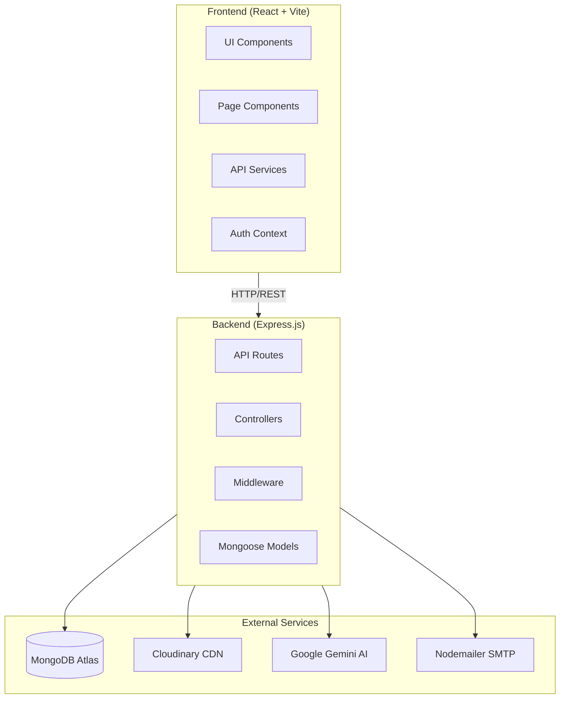
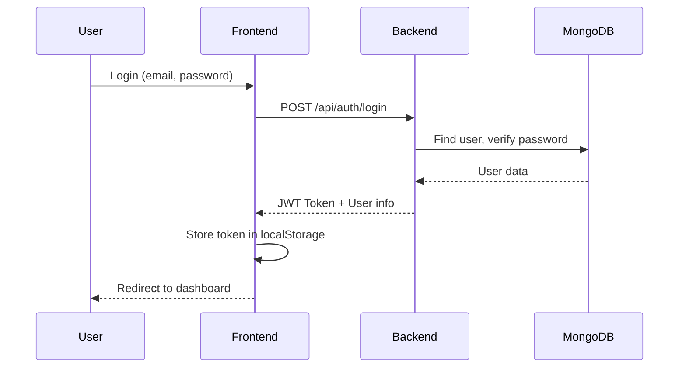
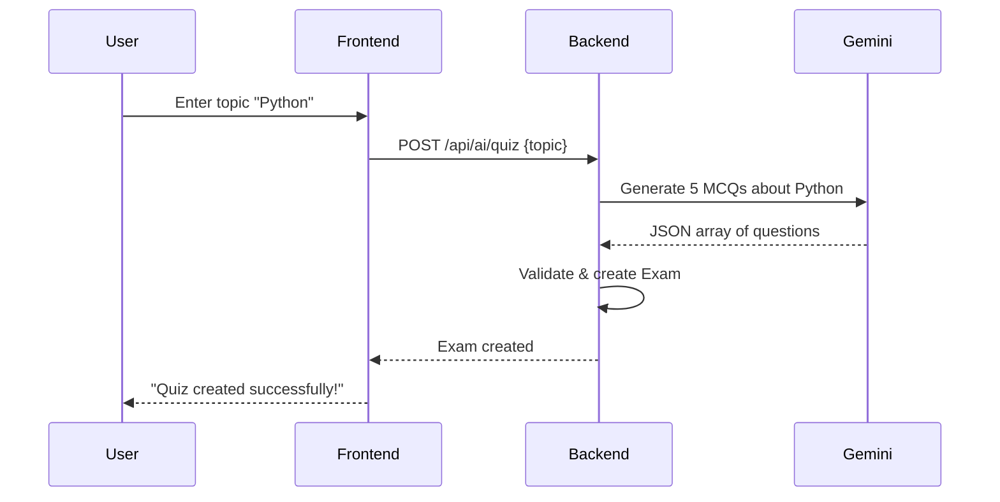
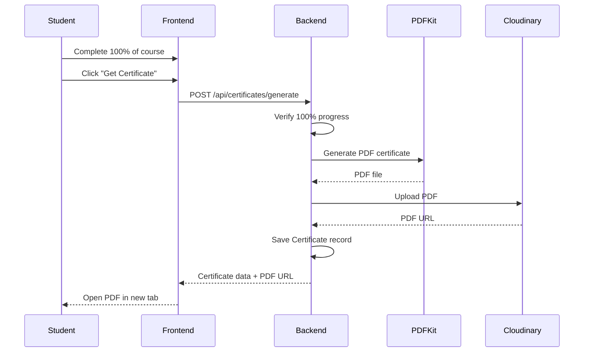

# SkillForge LMS - Complete Project Analysis

## 📌 Project Overview

**SkillForge** is a full-stack **Learning Management System (LMS)** built with the **MERN stack** (MongoDB, Express.js, React, Node.js). It enables students to enroll in courses, watch lessons, take AI-generated quizzes, and earn certificates upon completion. Instructors can create courses, add lessons with attachments, and monitor student performance through analytics dashboards.

---

## 🏗️ Architecture Overview



---

## 👥 User Roles & Permissions

| Role | Capabilities |
|------|-------------|
| **Student** | Browse courses, enroll, view lessons, take quizzes, earn certificates, AI chat |
| **Instructor** | All student features + Create/edit courses, add lessons, create quizzes, view analytics |
| **Admin** | All instructor features + User management, platform-wide analytics, delete users |

---

## 🔐 Authentication System

### Flow


### Features
- **JWT Authentication** with 30-day expiry
- **Password hashing** with bcrypt (12 rounds)
- **Protected routes** via `authenticate` middleware
- **Role-based authorization** via `authorize` middleware
- **Forgot/Reset Password** with email tokens (1hr expiry)
- **Dev Mode** password reset (shows link directly when email not configured)

### Key Files
| File | Purpose |
|------|---------|
| [auth.js](file:///c:/INTERNSHIP%20PROJECT/learnflow-dashboard-main%20(2)/learnflow-dashboard-main/backend/routes/auth.js) | Auth routes (login, register, forgot/reset password) |
| [middleware/auth.js](file:///c:/INTERNSHIP%20PROJECT/learnflow-dashboard-main%20(2)/learnflow-dashboard-main/backend/middleware/auth.js) | JWT verification & role checking |
| [AuthContext.tsx](file:///c:/INTERNSHIP%20PROJECT/learnflow-dashboard-main%20(2)/learnflow-dashboard-main/src/contexts/AuthContext.tsx) | React context for auth state |

---

## 📚 Course Management

### Course Model Structure
```javascript
{
  title: String,
  description: String,
  instructor: ObjectId → User,
  category: String,           // "Development", "Design", "Business", etc.
  level: String,              // "beginner", "intermediate", "advanced"
  thumbnail: { url, publicId },
  lessons: [ObjectId → Lesson],
  enrolledStudents: [ObjectId → User],
  status: "draft" | "published",
  price: Number,
  tags: [String],
  analytics: { totalEnrollments, averageRating, etc. }
}
```

### Course Features
| Feature | Description |
|---------|-------------|
| **Create Course** | Title, description, category, level, thumbnail upload |
| **Add Lessons** | Text content, video upload, file attachments |
| **Enrollment** | Students can enroll/unenroll from courses |
| **Progress Tracking** | Track completed lessons per student |
| **Publishing** | Draft → Published workflow |
| **Search & Filter** | By category, level, instructor |

### Key Files
| File | Purpose |
|------|---------|
| [Course.js](file:///c:/INTERNSHIP%20PROJECT/learnflow-dashboard-main%20(2)/learnflow-dashboard-main/backend/models/Course.js) | Course schema |
| [course.js](file:///c:/INTERNSHIP%20PROJECT/learnflow-dashboard-main%20(2)/learnflow-dashboard-main/backend/routes/course.js) | Course API routes |
| [CourseDetail.tsx](file:///c:/INTERNSHIP%20PROJECT/learnflow-dashboard-main%20(2)/learnflow-dashboard-main/src/pages/CourseDetail.tsx) | Course detail page |
| [CreateCourse.tsx](file:///c:/INTERNSHIP%20PROJECT/learnflow-dashboard-main%20(2)/learnflow-dashboard-main/src/pages/CreateCourse.tsx) | Course creation form |

---

## 📖 Lesson System

### Lesson Model Structure
```javascript
{
  title: String,
  description: String,
  course: ObjectId → Course,
  contentType: "video" | "text" | "pdf" | "mixed",
  content: String,           // Text content
  attachments: [{
    name: String,
    url: String,             // Cloudinary URL
    publicId: String,
    fileType: String,
    size: Number
  }],
  order: Number,
  estimatedDuration: Number, // in minutes
  isFree: Boolean,           // Preview lesson
  isPublished: Boolean
}
```

### Lesson Features
| Feature | Description |
|---------|-------------|
| **Video Lessons** | Upload and stream videos from Cloudinary |
| **Text Content** | Rich text lesson content |
| **File Attachments** | PDFs, documents, resources |
| **Progress Tracking** | Mark lessons complete |
| **Ordering** | Drag-and-drop lesson reordering |
| **Enrollment Gating** | Only enrolled students can access lessons |

### Key Files
| File | Purpose |
|------|---------|
| [Lesson.js](file:///c:/INTERNSHIP%20PROJECT/learnflow-dashboard-main%20(2)/learnflow-dashboard-main/backend/models/Lesson.js) | Lesson schema |
| [lesson.js](file:///c:/INTERNSHIP%20PROJECT/learnflow-dashboard-main%20(2)/learnflow-dashboard-main/backend/routes/lesson.js) | Lesson API routes |
| [LessonDetail.tsx](file:///c:/INTERNSHIP%20PROJECT/learnflow-dashboard-main%20(2)/learnflow-dashboard-main/src/pages/LessonDetail.tsx) | Lesson viewer |
| [AddLesson.tsx](file:///c:/INTERNSHIP%20PROJECT/learnflow-dashboard-main%20(2)/learnflow-dashboard-main/src/pages/AddLesson.tsx) | Lesson creation form |

---

## 📝 Exam/Quiz System

### Exam Model Structure
```javascript
{
  title: String,
  description: String,
  instructor: ObjectId → User,
  createdBy: ObjectId → User,
  quizType: "ai-generated" | "manual",
  duration: Number,          // in minutes
  questions: [{
    question: String,
    options: [String, String, String, String],
    correctAnswer: Number    // 0-3 index
  }],
  status: "draft" | "published",
  settings: {
    passingScore: Number,
    shuffleQuestions: Boolean,
    showResults: Boolean
  },
  submissions: [{
    student: ObjectId → User,
    answers: [Number],
    score: Number,
    submittedAt: Date
  }]
}
```

### Quiz Features
| Feature | Description |
|---------|-------------|
| **AI Quiz Generation** | Generate quizzes using Google Gemini AI |
| **Manual Quiz Creation** | Create quizzes with custom questions |
| **Publish/Unpublish** | Control quiz visibility |
| **Auto-grading** | Instant score calculation |
| **Submissions Tracking** | View all student attempts |
| **Timer** | Countdown timer during exam |

### AI Quiz Generation Flow


### Key Files
| File | Purpose |
|------|---------|
| [Exam.js](file:///c:/INTERNSHIP%20PROJECT/learnflow-dashboard-main%20(2)/learnflow-dashboard-main/backend/models/Exam.js) | Exam schema |
| [exam.js](file:///c:/INTERNSHIP%20PROJECT/learnflow-dashboard-main%20(2)/learnflow-dashboard-main/backend/routes/exam.js) | Exam API routes |
| [aiController.js](file:///c:/INTERNSHIP%20PROJECT/learnflow-dashboard-main%20(2)/learnflow-dashboard-main/backend/controllers/aiController.js) | AI quiz generation |
| [TakeExam.tsx](file:///c:/INTERNSHIP%20PROJECT/learnflow-dashboard-main%20(2)/learnflow-dashboard-main/src/pages/TakeExam.tsx) | Exam taking interface |

---

## 🏆 Certificate System

### Certificate Model Structure
```javascript
{
  student: ObjectId → User,
  course: ObjectId → Course,
  certificateId: String,     // Unique ID like "CERT-1234567890-ABCD"
  issueDate: Date,
  score: Number,             // Final course score
  pdfUrl: String,            // Cloudinary PDF URL
  verificationUrl: String
}
```

### Certificate Flow


### Key Files
| File | Purpose |
|------|---------|
| [Certificate.js](file:///c:/INTERNSHIP%20PROJECT/learnflow-dashboard-main%20(2)/learnflow-dashboard-main/backend/models/Certificate.js) | Certificate schema |
| [certificateController.js](file:///c:/INTERNSHIP%20PROJECT/learnflow-dashboard-main%20(2)/learnflow-dashboard-main/backend/controllers/certificateController.js) | Certificate logic |
| [certificateGenerator.js](file:///c:/INTERNSHIP%20PROJECT/learnflow-dashboard-main%20(2)/learnflow-dashboard-main/backend/utils/certificateGenerator.js) | PDF generation with PDFKit |

---

## 🤖 AI Features

### 1. AI Quiz Generation
- Uses **Google Gemini Flash** model
- Generates multiple-choice questions based on topic
- Validates question format (4 options, correct answer index)
- Creates exam record automatically

### 2. AI Chat Assistant
- Contextual help for students
- Knows platform features
- Personalized responses using user's name
- Conversation history support

### Key Files
| File | Purpose |
|------|---------|
| [aiController.js](file:///c:/INTERNSHIP%20PROJECT/learnflow-dashboard-main%20(2)/learnflow-dashboard-main/backend/controllers/aiController.js) | AI logic |
| [aiRoutes.js](file:///c:/INTERNSHIP%20PROJECT/learnflow-dashboard-main%20(2)/learnflow-dashboard-main/backend/routes/aiRoutes.js) | AI API routes |
| [ChatWidget.tsx](file:///c:/INTERNSHIP%20PROJECT/learnflow-dashboard-main%20(2)/learnflow-dashboard-main/src/components/ChatWidget.tsx) | Chat UI component |

---

## 📊 Analytics Dashboard

### Instructor Analytics
| Metric | Description |
|--------|-------------|
| Total Students | Students enrolled across all courses |
| Total Courses | Number of courses created |
| Avg. Completion Rate | Average course completion percentage |
| Avg. Exam Score | Average score across all exams |
| Recent Enrollments | Latest student enrollments |
| Top Performing Courses | Courses with highest completion rates |

### Admin Analytics
| Metric | Description |
|--------|-------------|
| Total Users | All registered users |
| User Distribution | Students vs Instructors vs Admins |
| User Management | View, delete users |

### Key Files
| File | Purpose |
|------|---------|
| [analyticsController.js](file:///c:/INTERNSHIP%20PROJECT/learnflow-dashboard-main%20(2)/learnflow-dashboard-main/backend/controllers/analyticsController.js) | Analytics logic |
| [AnalyticsDashboard.tsx](file:///c:/INTERNSHIP%20PROJECT/learnflow-dashboard-main%20(2)/learnflow-dashboard-main/src/pages/AnalyticsDashboard.tsx) | Analytics UI |

---

## 📁 File Upload System

### Cloudinary Integration
```javascript
// config/cloudinary.js
cloudinary.config({
  cloud_name: process.env.CLOUDINARY_CLOUD_NAME,
  api_key: process.env.CLOUDINARY_API_KEY,
  api_secret: process.env.CLOUDINARY_API_SECRET
});
```

### Supported Uploads
| Type | Max Size | Formats |
|------|----------|---------|
| **Profile Photos** | 5MB | JPG, PNG, WebP |
| **Course Thumbnails** | 10MB | JPG, PNG, WebP |
| **Lesson Videos** | 100MB | MP4, WebM, MOV |
| **Attachments** | 50MB | PDF, DOC, DOCX, etc. |
| **Certificates** | Auto | PDF |

### Key Files
| File | Purpose |
|------|---------|
| [cloudinary.js](file:///c:/INTERNSHIP%20PROJECT/learnflow-dashboard-main%20(2)/learnflow-dashboard-main/backend/config/cloudinary.js) | Cloudinary config & multer setup |
| [upload.js](file:///c:/INTERNSHIP%20PROJECT/learnflow-dashboard-main%20(2)/learnflow-dashboard-main/backend/routes/upload.js) | Upload routes |

---

## 🛡️ Security Features

| Feature | Implementation |
|---------|---------------|
| **Password Hashing** | bcrypt with 12 salt rounds |
| **JWT Authentication** | 30-day expiry tokens |
| **Protected Routes** | Middleware-based auth checks |
| **Role Authorization** | Role-based access control |
| **Input Validation** | Express-validator middleware |
| **Error Handling** | Global error handler with stack traces (dev only) |
| **CORS** | Configured for specific origins |
| **Rate Limiting** | Built into Gemini API |

---

## 🌐 API Endpoints Summary

### Authentication
| Method | Endpoint | Description |
|--------|----------|-------------|
| POST | `/api/auth/register` | Register new user |
| POST | `/api/auth/login` | Login user |
| POST | `/api/auth/forgot-password` | Request password reset |
| POST | `/api/auth/reset-password/:token` | Reset password |
| PUT | `/api/auth/change-password` | Change password |

### Users
| Method | Endpoint | Description |
|--------|----------|-------------|
| GET | `/api/users/profile` | Get current user profile |
| PUT | `/api/users/profile` | Update profile |
| POST | `/api/users/profile/avatar` | Upload avatar |
| DELETE | `/api/users/profile/avatar` | Remove avatar |
| GET | `/api/users` | Get all users (admin) |
| DELETE | `/api/users/:id` | Delete user (admin) |

### Courses
| Method | Endpoint | Description |
|--------|----------|-------------|
| GET | `/api/courses` | Get all published courses |
| GET | `/api/courses/my-courses` | Get instructor's courses |
| GET | `/api/courses/enrolled` | Get enrolled courses |
| POST | `/api/courses` | Create course |
| GET | `/api/courses/:id` | Get course details |
| PATCH | `/api/courses/:id` | Update course |
| DELETE | `/api/courses/:id` | Delete course |
| POST | `/api/courses/:id/enroll` | Enroll in course |
| DELETE | `/api/courses/:id/unenroll` | Unenroll from course |

### Lessons
| Method | Endpoint | Description |
|--------|----------|-------------|
| GET | `/api/lessons/:id` | Get lesson |
| POST | `/api/lessons` | Create lesson |
| PATCH | `/api/lessons/:id` | Update lesson |
| DELETE | `/api/lessons/:id` | Delete lesson |
| POST | `/api/lessons/:id/complete` | Mark lesson complete |

### Exams
| Method | Endpoint | Description |
|--------|----------|-------------|
| GET | `/api/exams` | Get all exams |
| GET | `/api/exams/my-exams` | Get instructor's exams |
| POST | `/api/exams` | Create exam |
| GET | `/api/exams/:id` | Get exam |
| PUT | `/api/exams/:id` | Update exam |
| DELETE | `/api/exams/:id` | Delete exam |
| POST | `/api/exams/:id/publish` | Publish exam |
| POST | `/api/exams/:id/submit` | Submit exam |
| GET | `/api/exams/:id/submissions` | Get submissions |

### AI
| Method | Endpoint | Description |
|--------|----------|-------------|
| POST | `/api/ai/quiz` | Generate AI quiz |
| POST | `/api/ai/chat` | Chat with AI assistant |
| GET | `/api/ai/recommendations` | Get course recommendations |

### Certificates
| Method | Endpoint | Description |
|--------|----------|-------------|
| POST | `/api/certificates/generate` | Generate certificate |
| GET | `/api/certificates/my-certificates` | Get user's certificates |
| GET | `/api/certificates/verify/:id` | Verify certificate |
| DELETE | `/api/certificates/:courseId` | Delete certificate |

---

## 🎨 Frontend Pages

| Page | Route | Description |
|------|-------|-------------|
| Landing | `/` | Home page with features |
| Auth | `/auth` | Login/Register |
| Forgot Password | `/forgot-password` | Password reset request |
| Reset Password | `/reset-password/:token` | Set new password |
| Courses | `/courses` | Browse all courses |
| Course Detail | `/courses/:id` | Single course view |
| Create Course | `/create-course` | New course form |
| Edit Course | `/courses/:id/edit` | Edit course |
| Lesson Detail | `/lesson/:id` | View lesson content |
| Add Lesson | `/courses/:id/lessons/add` | New lesson form |
| Edit Lesson | `/courses/:id/lessons/:lessonId/edit` | Edit lesson |
| Take Exam | `/take-exam/:id` | Exam interface |
| Exam Submissions | `/exam-submissions/:id` | View submissions |
| Profile | `/profile` | User profile |
| Student Dashboard | `/student-dashboard` | Student home |
| Instructor Dashboard | `/instructor-dashboard` | Instructor home |
| Admin Dashboard | `/admin-dashboard` | Admin home |
| Analytics | `/analytics` | Stats & reports |

---

## 🚀 Getting Started

### Prerequisites
- Node.js 18+
- MongoDB Atlas account
- Cloudinary account
- Google Gemini API key

### Environment Variables
```env
# Backend (.env)
MONGODB_URI=mongodb+srv://...
JWT_SECRET=your-secret-key
CLIENT_URL=http://localhost:5173

CLOUDINARY_CLOUD_NAME=your-cloud
CLOUDINARY_API_KEY=your-key
CLOUDINARY_API_SECRET=your-secret

GEMINI_API_KEY=your-gemini-key

EMAIL_HOST=smtp.gmail.com
EMAIL_PORT=587
EMAIL_USER=your-email
EMAIL_PASS=your-app-password
```

```env
# Frontend (.env)
VITE_API_URL=http://localhost:5000/api
```

### Running Locally
```bash
# Backend
cd backend
npm install
node server.js

# Frontend (new terminal)
npm install
npm run dev
```

---

## ✅ Features Completed

- [x] User authentication (register, login, JWT)
- [x] Password reset via email
- [x] Role-based access (Student, Instructor, Admin)
- [x] Course CRUD with thumbnail upload
- [x] Lesson CRUD with video/file attachments
- [x] Course enrollment/unenrollment
- [x] Progress tracking (lesson completion)
- [x] AI quiz generation (Gemini)
- [x] Manual quiz creation
- [x] Exam submission & auto-grading
- [x] Certificate generation (PDF)
- [x] Profile management with avatar
- [x] AI chat assistant
- [x] Analytics dashboards
- [x] Admin user management
- [x] Enrollment protection for lessons
- [x] Real-time updates (WebSocket)

---

## 📈 Future Enhancements

| Feature | Priority |
|---------|----------|
| Payment integration (Stripe/Razorpay) | High |
| Course reviews & ratings | Medium |
| Discussion forums | Medium |
| Email notifications | Medium |
| Mobile app (React Native) | Low |
| Video transcoding | Low |
| SSO (Google/GitHub login) | Low |

---

*Document generated on January 9, 2026*
